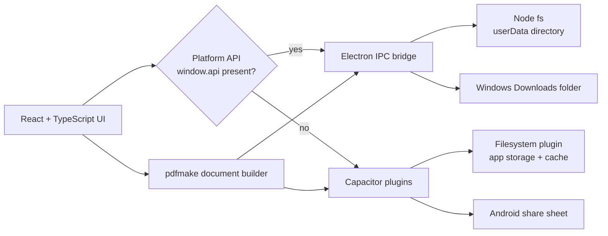

<p align="center">
  
</p>

<p align="center">
  Desktop and Android app for generating henna business contracts as PDFs.
</p>

---

Consulting project built for [Tampa Bay Henna by Fatema](https://share.google/5H7aY44qjFnuBpkPL), a Tampa-area henna artistry business.

The client previously managed contracts by duplicating a Google Doc, renaming it, and manually filling in placeholder dashes for every new booking. HennaDocs replaces that flow with a form-driven app that generates a properly formatted PDF, saves it locally, and lets the artist share it directly to email, messaging, or Drive from her phone.

## Features

- Single long form for client info, one or more events, free-form pricing line items, deposit status, and photography consent
- Vector PDF generation with selectable text (not a rasterized image) matching the original contract layout
- Local, per-device storage. No accounts, no cloud, no sync
- Runs as a native Windows app and an Android app from a single React codebase

## Screenshots

_Placeholders. To be replaced with real captures._

|  Home | New contract | Generated PDF |
| :---: | :---: | :---: |
|  |  |  |

## Architecture



The renderer is a shared React app. A runtime detector picks the Electron IPC bridge when `window.api` is exposed by the preload script and falls back to Capacitor plugins on Android. PDFs are built entirely on the client with `pdfmake` from a shared document definition in `shared/pdfDoc.ts`, then either saved to disk via IPC (desktop) or written to the cache directory and handed to the native share sheet (Android).

## Tech stack

- **React 18 + TypeScript** for the UI
- **Vite** for the renderer bundle
- **Electron 30** for the Windows desktop app
- **Capacitor 8** for the Android app
- **pdfmake** for vector PDF generation

## Repository layout

```
electron/          main process, preload bridge, ipc handlers, local storage
shared/            types and pdfmake document definition shared by both platforms
src/               react renderer (screens, components, platform api adapters)
android/           capacitor-generated android project
resources/         source icon consumed by @capacitor/assets
docs/              readme assets
```

## Development

```bash
npm install
npm run dev              # electron shell + vite dev server
npm run android:install  # build and install debug APK on connected device or emulator
npm run package          # produce a Windows installer via electron-builder
```

Android builds require JDK 17. The pinned toolchain path lives in `android/gradle.properties`.

## License

Proprietary. All rights reserved. See [LICENSE](LICENSE). This source is published for viewing and portfolio review only. No use, copying, redistribution, or derivative works are permitted without prior written permission from the copyright holder.
